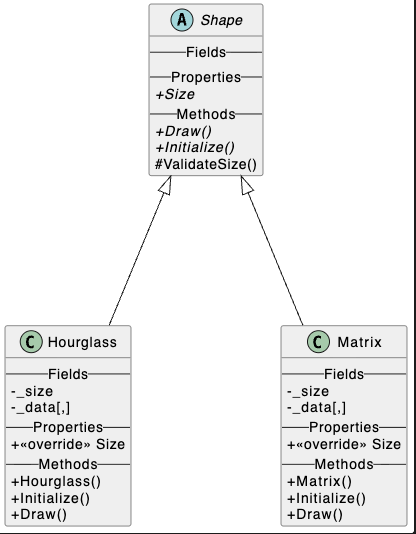

# Matrix & Hourglass Pattern Generator

A C# console application designed to demonstrate **Object-Oriented Programming (OOP)** principles such as **Abstraction, Inheritance, and Polymorphism**. This system generates mathematical matrices and visual geometric patterns based on user input.


## Features

* **Matrix Generation**: Creates an $N \times N$ matrix where each element is the sum of its indices $(i + j)$.
* **Hourglass Pattern**: Generates a symmetrical hourglass shape using a specialized formula $(i \times 2) + j$ to reach specific values (e.g., 0 to 30 for an 11x11 matrix).
* **Dynamic Visualizations**: Option to view full reference matrices or filtered patterns (Lower Triangular or Hourglass).
* **Input Validation**: Strict validation ensures matrices are positive and hourglasses use odd numbers for perfect symmetry.
* **UML Automation**: Includes a Bash script to automatically generate PlantUML diagrams from the source code.

## Architecture & Design Patterns

The project follows a **Decoupled Architecture** where the logic (Backend) is separated from the user interface (Frontend).

### OOP Principles Applied
* **Abstraction**: The `Shape` base class defines the "contract" (`Size`, `Initialize`, `Draw`) without dictating how specific shapes work.
* **Inheritance**: `Matrix` and `Hourglass` inherit shared logic like `ValidateSize` from the `Shape` class to avoid code duplication.
* **Polymorphism**: The `Program.cs` entry point treats different objects as a generic `Shape`, allowing for extensible and clean code.

## Technical Stack

* **Language**: C# 13 (.NET 10).
* **Linter**: Microsoft CodeAnalysis NetAnalyzers.
* **Diagramming**: PlantUML via custom automation.
* **Environment**: Developed on Apple Silicon (M3 Pro).

## Project Structure

```text
.
├── Exercises
│   └── Backend
│       ├── Shape.cs         # Abstract base class with shared validation
│       ├── Matrix.cs        # Matrix (i + j) implementation
│       └── Hourglass.cs     # Hourglass ((i * 2) + j) implementation
├── Program.cs               # Frontend & Interactive Menu System
└── generate_diagram.sh      # UML Automation script for macOS/Linux
```


## Setup & Installation

1.  **Clone the repository**:
    ```bash
    git clone https://github.com/dcanosu/ProgramingExercises.git
    cd ProgramingExcercises/ProgramingExcercises
    ```
2.  **Restore dependencies and lint**:
    ```bash
    dotnet restore
    ```
3.  **Run the project**:
    ```bash
    dotnet build
    ```

4. **Run the application:**
    ```bash
    dotnet run --project Frontend

## Automation Script

To regenerate the UML diagrams with the "Fields", "Properties", and "Methods" labels, run:
```bash
cd ProgramingExcercises/Backend
chmod +x generate_diagram.sh
./generate_diagram.sh
```

## Example Output4
### Matrix (Size 10):
```bash
--- Full Matrix ---

   0   1   2   3   4   5   6   7   8   9
   1   2   3   4   5   6   7   8   9  10
   2   3   4   5   6   7   8   9  10  11
   3   4   5   6   7   8   9  10  11  12
   4   5   6   7   8   9  10  11  12  13
   5   6   7   8   9  10  11  12  13  14
   6   7   8   9  10  11  12  13  14  15
   7   8   9  10  11  12  13  14  15  16
   8   9  10  11  12  13  14  15  16  17
   9  10  11  12  13  14  15  16  17  18

--- Lower Triangular Matrix ---

   0                                    
   1   2                                
   2   3   4                            
   3   4   5   6                        
   4   5   6   7   8                    
   5   6   7   8   9  10                
   6   7   8   9  10  11  12            
   7   8   9  10  11  12  13  14        
   8   9  10  11  12  13  14  15  16    
   9  10  11  12  13  14  15  16  17  18
```

### Hourglass (Size 11):
```bash
--- Full Reference Matrix ---

   0   1   2   3   4   5   6   7   8   9  10
   2   3   4   5   6   7   8   9  10  11  12
   4   5   6   7   8   9  10  11  12  13  14
   6   7   8   9  10  11  12  13  14  15  16
   8   9  10  11  12  13  14  15  16  17  18
  10  11  12  13  14  15  16  17  18  19  20
  12  13  14  15  16  17  18  19  20  21  22
  14  15  16  17  18  19  20  21  22  23  24
  16  17  18  19  20  21  22  23  24  25  26
  18  19  20  21  22  23  24  25  26  27  28
  20  21  22  23  24  25  26  27  28  29  30

--- Hourglass Pattern ---

   0   1   2   3   4   5   6   7   8   9  10
       3   4   5   6   7   8   9  10  11    
           6   7   8   9  10  11  12        
               9  10  11  12  13            
                  12  13  14                
                      15                    
                  16  17  18                
              17  18  19  20  21            
          18  19  20  21  22  23  24        
      19  20  21  22  23  24  25  26  27    
  20  21  22  23  24  25  26  27  28  29  30
```


